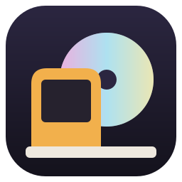
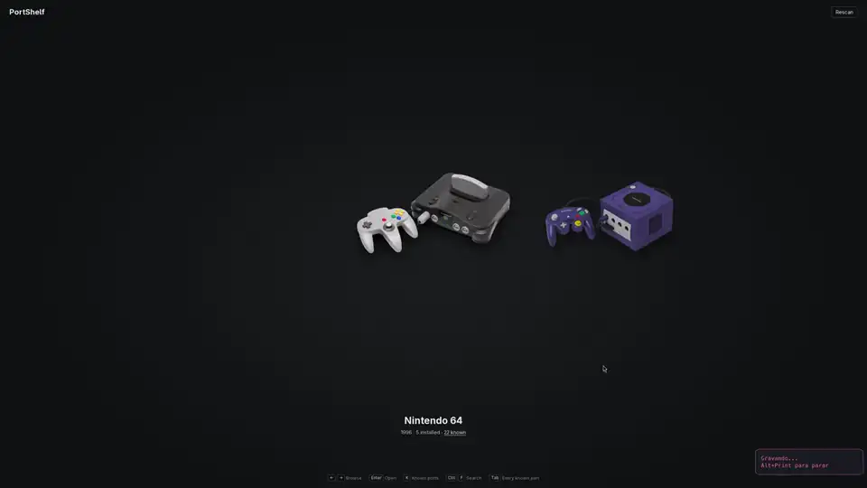

<p align="center"></p>

<h1 align="center">PortShelf</h1>

PortShelf is a launcher for native PC ports of console games: static recompilations (N64: Recompiled, Xbox 360 recompilations and others), decompilation projects (Harbour Masters ports, Dusklight, OpenGOAL) and builders that produce a port from your own game file. Each system appears as its console; opening it shows its ports as cartridges or discs that can be installed, started, configured and looked up. Every port runs on your own copy of the game.

**Work in progress.**



## Features

- 67 ports across eleven systems, from Arcade and NES to Xbox 360 and Wii
- Browse systems, then games, with the keyboard, a controller or the mouse
- Installs ports from their GitHub or GitLab releases
- Opens each port on its own launcher, with the game file already in place
- Records your time played
- Checks that your game file is the release each port needs, including zip and 7z archives
- Organises your ROM folder by system and game, and picks up new files on its own
- Edits the settings of RecompFrontend ports
- Finds cover art automatically; covers and names can be changed per game
- Search across every system and a list of every known port with links to each project
- Four colour themes, each with a light and a dark mode
- English and Brazilian Portuguese

## Controls

| Action | Keyboard | Controller |
|---|---|---|
| Browse | Left / Right | D-pad or left stick |
| Open system / play | Enter | South face button (Xbox A, PlayStation Cross) |
| Back | Esc | East face button (Xbox B, PlayStation Circle) |
| Quit (from the systems screen, then confirm) | Esc | East face button |
| Port settings (games screen) | S | North face button (Xbox Y, PlayStation Triangle) |
| Known ports of the system | K | West face button (Xbox X, PlayStation Square) |
| Rename | R | |
| Add port | P | |
| PortShelf settings | O | North face button (systems screen) |
| Next theme / light or dark mode | T / M | |
| English or Brazilian Portuguese | L | |
| Choose a game file for the system in view | I | |
| Search every system | Ctrl+F | Start |
| Every known port or installed only | Tab | Select |
| Previous or next system while viewing games | | LB / RB |

Controllers are read natively with gilrs, so they work where the webview has no Gamepad API. Only the focused PortShelf window reacts to the controller.

## Data

| What | Location on Linux |
|---|---|
| Ports installed by PortShelf | `~/.local/share/PortShelf/ports/<port id>/` (Windows: `%LOCALAPPDATA%\PortShelf\ports`, macOS: `~/Library/Application Support/PortShelf/ports`) |
| Library (installed ports and how to start them) | `~/.config/portshelf/library.json` |
| Cover art | `~/.config/portshelf/covers/<port id>.png` (replaced covers are kept in `covers/replaced/`) |
| Time played | `~/.config/portshelf/playtime.json` |
| Cover index, downloads and unpacked archives | `~/.cache/portshelf/` |
| Game files | the ROM folder you choose, organised as `<system>/<game>/` |
| Game file handed to a recompilation port | the port's own folder, `~/.config/<program_id>/<game_id>.z64` (Windows: `%LOCALAPPDATA%\<program_id>`) |

The library is created on first run by scanning the usual install locations, and refreshed whenever the window comes back into focus; covers chosen by hand are kept.

Cover art comes from [libretro-thumbnails](https://github.com/libretro-thumbnails), matched by the No-Intro or Redump title recorded in the catalog, preferring the USA release. A cover chosen by hand is never replaced by scraping.

## Catalog

`catalog/ports.json` lists the systems (name, release year, media type, accent colour) and the known ports. Each port has its system, kind (recompilation, decompilation, builder or remake), project page and No-Intro or Redump title, and can also carry:

- `install`: per operating system, the words that identify the release asset and the program to start, plus the settings folder and how the port expects its game file
- `recomp`: for N64: Recompiled ports, the `program_id` and `game_id` read from each project's source. The port keeps its settings in `~/.config/<program_id>` on Linux (`%LOCALAPPDATA%\<program_id>` on Windows) and looks for the ROM there as `<game_id>.z64`, so PortShelf places the checked ROM exactly where the port's own launcher finds it
- `rom`: the release of the game the port needs, with the hashes of the accepted files (`xxh3:`, `sha1:`, `md5:` or `sha256:`)
- `codes` (N64 game codes such as `NDOE`, GameCube IDs such as `GZ2E`), `authors`, `platforms` for ports made only for another operating system, and a cartridge colour

Only ports that need the player's own game are listed. The list was put together from [PCGamingWiki's list of unofficial ports](https://www.pcgamingwiki.com/wiki/List_of_unofficial_ports) and [awesome-unofficial-pc-ports](https://github.com/Sebastrion/awesome-unofficial-pc-ports).

In `src-tauri`, `cargo run --example install -- <port id> <folder>` tests an install rule without the interface, `cargo run --example scan -- <folder>` shows which ports the game files in a folder match, and `cargo test` checks every catalog entry.

## Project structure

The interface (Svelte, in `src/`) runs in the app's web view; everything that touches the system (files, downloads, processes, the controller) runs in the Rust backend (`src-tauri/`). The interface calls backend commands with `invoke`, all of them from `src/lib/shelf.svelte.ts`, and the backend sends events back (`pad` for the controller, `install-progress`, `game-exited`).

```
src/
  routes/+page.svelte       navigation, keyboard and controller, which dialog is open
  lib/shelf.svelte.ts       shelf state and every call to the backend
  lib/prefs.svelte.ts       theme, light or dark mode, language
  lib/components/
    shelf/                  carousel, captions, header, key hints
    dialogs/  panels/       settings, add port, search, quit; known ports, port settings
    media/                  cartridge, disc, console photo, system logo
    ui/                     dialog and side panel frames, list rows, button glyphs
src-tauri/src/
  lib.rs                    registers the modules and their commands
  catalog.rs  library.rs    the port list; the user's library
  ports.rs                  installing ports and adding ones installed by hand
  roms.rs                   game file status, handing files to ports, the ROM folder
  launch.rs  playtime.rs    starting a port; time played
  covers.rs  port_settings.rs  paths.rs
  install.rs  romscan.rs  scrape.rs  gamepad.rs   downloads, game file identification, cover search, controller
```

## Development

Requirements: Rust, Node.js, pnpm and, on Linux, WebKitGTK 4.1.

```bash
pnpm install
pnpm app      # development build; also rebuilds when catalog/ changes
pnpm bundle   # AppImage in src-tauri/target/release/bundle/appimage/
```

Programs started from the AppImage (ports and the file manager) get a clean environment, without the AppImage's bundled library and data paths. On Linux the app sets `WEBKIT_DISABLE_DMABUF_RENDERER=1` for itself, which avoids a Wayland protocol error with NVIDIA drivers. `pnpm bundle` sets `NO_STRIP`, needed on distributions whose libraries are newer than the `strip` bundled with linuxdeploy. The development window is titled `PortShelf (dev)`, so a window manager rule can tell it apart from the installed app.

On Linux the window has no title bar, since tiling compositors do not draw one and GTK would add its own buttons; Windows and macOS keep their native title bar.

## Disclaimer

PortShelf is an unofficial fan project. It is not affiliated with, endorsed by or sponsored by Nintendo, Sony, Microsoft, Sega or any other game company, nor by the authors of the ports it lists.

PortShelf does not include, download or distribute games, ROMs, disc images, BIOS files or any other copyrighted game data. It only downloads the ports themselves, from their projects' public releases, and every port needs a copy of the game supplied by the player. Use only game files you are legally entitled to use, such as dumps of games you own.

Each port is a separate project under its own license, and its authors are responsible for it. Game titles, console names, logos and cover art belong to their respective owners and are shown only to identify the games and systems.

## License

PortShelf's code is released under the [MIT License](LICENSE). Images and fonts bundled with it keep their own licenses, listed in [CREDITS.md](CREDITS.md).

## Credits

Built with [Tauri](https://tauri.app) and [Svelte](https://svelte.dev). Console photographs by Evan-Amos and others on Wikimedia Commons; see [CREDITS.md](CREDITS.md) for every image source and license.
